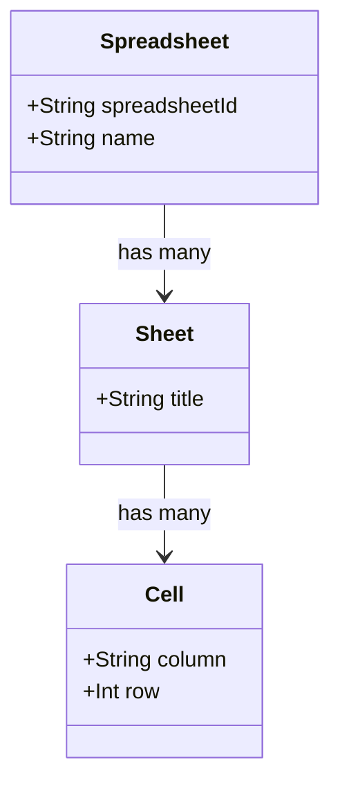
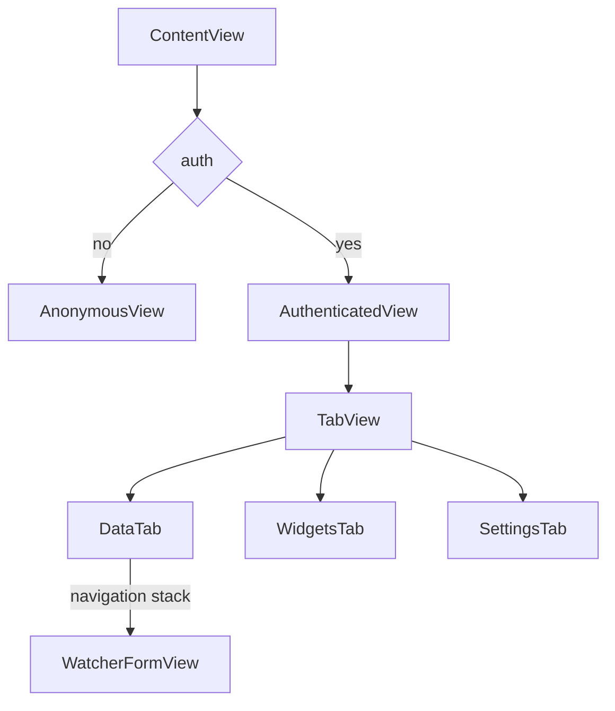

# Google Sheets Widget

Google Sheets Widget app allow you to track your spreadsheets right inside your iOS

Here is how short video of hot it will look like

[](https://www.youtube.com/watch?v=_TSAgsGCIwk)

## Privacy

The app does not collect and store any personal information.

## Data Model

We are working with `Spreadsheets`, each has some `Sheets` containing many `Cells`



## Views



## Google

### Application

From google side we have an "GoogleSheetsWidget" Google Cloud Project

| Key            | Val                    |
| -------------- | ---------------------- |
| Project name   | GoogleSheetsWidget     |
| Project number | 165877850855           |
| Project ID     | erudite-calling-417313 |

And registered client application

| Key            | Val                                                                        |
| -------------- | -------------------------------------------------------------------------- |
| Name           | GoogleSheetsWidget                                                         |
| Bundle ID      | `ua.org.mac-blog.GoogleSheetsWidget`                                       |
| App Store ID   | empty                                                                      |
| Team ID        | empty                                                                      |
| Client ID      | `165877850855-o5k0ftcnlh8cukro95ujd4vspbghfp58.apps.googleusercontent.com` |
| iOS URL scheme | `com.googleusercontent.apps.165877850855-o5k0ftcnlh8cukro95ujd4vspbghfp58` |

### API

For us to talk to Google API we need an access token that can be retrieved here:

[https://developers.google.com/oauthplayground](https://developers.google.com/oauthplayground/)

**Step 1 Select & authorize APIs**

Enter `https://www.googleapis.com/auth/drive.readonly`

**Step 2 Exchange authorization code for tokens**

Just presss "Exchange authorization code for token" button

Then export your token like so:

```bash
export access_token="..."
```

**Retrieve list of Spreadsheets**

```bash
curl -s "https://www.googleapis.com/drive/v3/files?q=mimeType='application/vnd.google-apps.spreadsheet'" -H "Authorization: Bearer $access_token" | jq -r ".files[] | [.id, .name] | @tsv"
```

example output

```log
11111111111111111111111111111111111111111111	Untitled spreadsheet
22222222222222222222222222222222222222222222    Demo
```

**Retrieve sheets**

```bash
spreadsheetId='1d78yVZ569Glf0Zxsu29eDED00veHjd8Gk4GxyIxkx1I'
curl -s "https://sheets.googleapis.com/v4/spreadsheets/$spreadsheetId" -H "Authorization: Bearer $access_token" | jq -r '.sheets[].properties.title'
```

example output

```
Sheet1
Sheet2
```

**Retrieve cell value**

```bash
spreadsheetId='1d78yVZ569Glf0Zxsu29eDED00veHjd8Gk4GxyIxkx1I'
range='Data!B3:C5'
curl -s "https://sheets.googleapis.com/v4/spreadsheets/$spreadsheetId/values/$range" -H "Authorization: Bearer $access_token" | jq -r ".values[] | @tsv"
```

```
Hello   1
World   2
```

## Notes

Xcode caches cleanup

```bash
rm -rf ~/Library/Developer/Xcode/DerivedData/*
rm -rf ~/Library/Caches/com.apple.dt.Xcode
```
